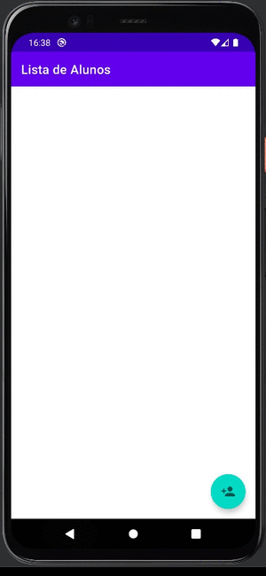

<h1 align="center">
 
Fundamentos Android 1
</h1>

Fundamentos iniciais no desenvolvimento de aplicações Android

### Conceitos abordados: 

- o que é o Android e onde é utilizado;

-  instalar o Android Studio;

-  criar um projeto Android;

-  criar uma Activity;

-  adicionar comportamentos na Activity.

- adicionar Views via código Java e via arquivo estático;

- implementar layouts que apresentam listas;

- utilizar AdapterViews em específico o ListView.

- Adicionar um FloatingActionButton;

- Implementar o layout via código fonte em XML;

- Atributos comuns na implementação de views;

- Medidas comuns para suporte de telas distintas.

- Adicionar ícones no projeto;

- Implementar layout via XML;

- Implementar layouts com o LinearLayout;

- Implementar layout de formulário;

- Refatorar Activities em relação ao pacote e nomes;

- Implementar App Bar e uso do AppCompatActivity.

- Aplicar comportamentos nas views com listeners;

- Aplicar técnica de persistência de dados a partir do padrão DAO;

- Utilizar adequadamente os estados do ciclo de vida de uma Activity;

- Refatorar o código das Activities.

### Certificado: 

