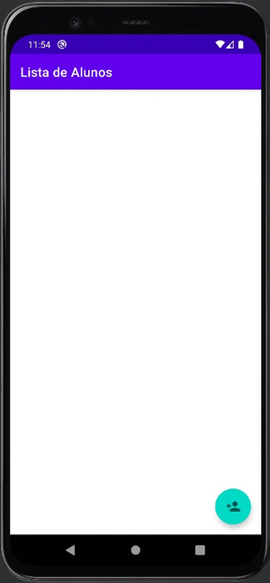

<h1 align="center">
 
Fundamentos Android 1
</h1>

Fundamentos iniciais no desenvolvimento de aplicações Android

### Conceitos abordados: 

- Criar layouts personalizados para `ListView`
- Migrar de ArrayAdapter para adapter personalizado
- Implementar Adapter personalizado por meio do `BaseAdapter`
- Necessidade de caixa de diálogo para confirmação
- Implementação de dialog com `AlertDialog`
- Utilizar o inspetor de código do Android Studio
- Como funciona a inspeção do lint
- Resolver tópicos do Android
- Suprimir alertas

### Certificado: 

