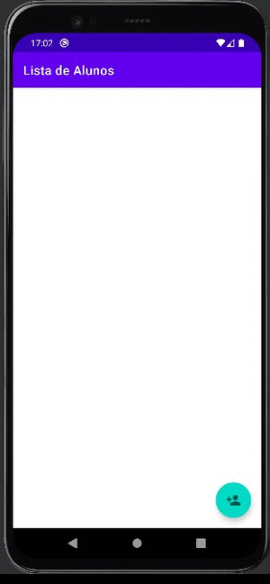

<h1 align="center">
 
Fundamentos Android 2
</h1>

Fundamentos iniciais no desenvolvimento de aplicações Android

### Conceitos abordados: 

- Implementar listener para `AdapterView`
- Utilizar o log do Android
- Transferir dados entre `Activities`
- Lidar de maneira adequada com `extra`
- Implementar comportamentos de edição
- Salvar e editar na mesma `Activity` de formulário
- Refatorar código
- Implementar a feature de remoção em `AdapterViews`
- Analisar e refatorar códigos que não precisam ser executados mais de uma vez
- Utilizar a referência do Adapter para manipular os dados do `AdapterView`
- Implementar menu de contexto
- Criar menus via arquivo estático
- Realizar o processo de inflar menu
- Configurar listener de menu adequadamente

### Certificado: 

