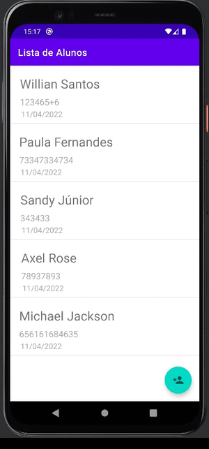

<h1 align="center">
 
Android Room 1
</h1>

Fundamentos iniciais no desenvolvimento de aplicações Android

### Conceitos abordados: 

- O que são as opções de armazenamento do Android
- Que para dados estruturados, utilizamos o banco de dados
- O Android utiliza o SQLite como banco de dados
- Utilizar o Room como melhor alternativa para implementar o banco de dados
- Adicionar o Room ao projeto
- Implementar os principais componentes do Room
- Permitir a execução do Room na thread principal
- Evitar o problema de referências que recebem o `Context`
- Implementar um CRUD com o Room
- Centralizar a criação de instância do Database
- O que são `migrations`, e como funcionam no Room
- Destruir as migrations, para mudar o banco de dados quando temos mudança na entidade
- Usar a destruição de migration apenas durante o desenvolvimento e enquanto o App não for publicado
- Implementar migration para adicionar campos novos
- Investigar o código de implementação do Room
- Salvar tipos de dados que não são convertidos automaticamente
- Refatorar o código do Database.

### Certificado: 

